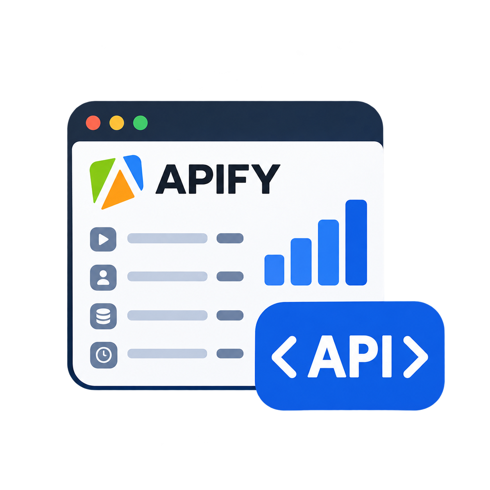
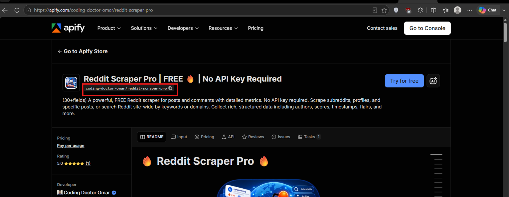

# Apify Actor Stats API

<p align="center">
    
</p>

<p align="center">
  <a href="https://ko-fi.com/CodingDoctorOmar">
    
  </a>
</p>

## Introduction

**Apify Actor Stats API** is an unofficial, lightweight API that returns public Apify Actor stats for any given Actor slug. The purpose of this API is to provide a seamless way to get your public Actor stats without having to make complex Algolia POST requests. This API should make it easy to use your public Actor stats to create your custom Actor README badges via services like shield.io.


## Documentation

**BASE URL: `https://apify-actor-stats.vercel.app`**

**ENDPOINTS:**

1. GET &mdash; `/api/v1/actor-stats`

    **URL Query Parameters:**

    `actor_slug` &ndash; [*string*][*required*] &mdash; The Actor slug (e.g. `coding-doctor-omar/reddit-scraper-pro`).

## Example Python Usage

**STEP 1: Install requests.**

```bash
pip install requests
```

**STEP 2: Make a GET request to `/api/v1/actor-stats`.**

```python
import requests

base_url = "https://apify-actor-stats.vercel.app"
endpoint = "/api/v1/actor-stats"

parameters = {
    "actor_slug": "coding-doctor-omar/reddit-scraper-pro"
}

response = requests.get(url=base_url + endpoint, params=parameters)
actor_stats = response.json()

print(actor_stats)
```

## Example API Response

```json
{
  "actorReviewCount": 1,
  "actorReviewRating": 5,
  "badge": null,
  "bookmarkCount": 0,
  "categories": [],
  "currentPricingInfo": {
    "pricingModel": "FREE"
  },
  "description": "(30+fields) A powerful, FREE Reddit scraper for posts and comments with detailed metrics. No API key required. Scrape subreddits, profiles, and specific posts, or search Reddit site-wide by keywords or domains. Collect rich, structured data including authors, scores, timestamps, flairs, and more.",
  "isWhiteListedForAgenticPayments": false,
  "name": "Reddit-Scraper-Pro",
  "notice": "NONE",
  "objectID": "mw5JvRF7kSxjfNqdu",
  "pictureUrl": "https://apify-image-uploads-prod.s3.us-east-1.amazonaws.com/9ZFcPlTHP3OBsxE7I-actor-mw5JvRF7kSxjfNqdu-G2h1xdIb3w-reddit_scraper_pro.png",
  "stats": {
    "actorReviewCount": 0,
    "actorReviewRating": 0,
    "bookmarkCount": 0,
    "lastRunStartedAt": "2026-09-19T10:52:34.876Z",
    "publicActorRunStats30Days": {
      "ABORTED": 7,
      "FAILED": 13,
      "SUCCEEDED": 303,
      "TIMED-OUT": 3,
      "TOTAL": 326
    },
    "totalBuilds": 39,
    "totalRuns": 377,
    "totalUsers": 43,
    "totalUsers30Days": 21,
    "totalUsers7Days": 14,
    "totalUsers90Days": 21
  },
  "successRate": 92.9,
  "title": "Reddit Scraper Pro | FREE 🔥 | No API Key Required",
  "userFullName": "Coding Doctor Omar",
  "userPictureUrl": "https://images.apifyusercontent.com/8AkahZMXUZ0taLaTtZGgfXYIkmsY3nFvOfaEj1CkND8/rs:fill:32:32/cb:1/aHR0cHM6Ly9hcGlmeS1pbWFnZS11cGxvYWRzLXByb2QuczMudXMtZWFzdC0xLmFtYXpvbmF3cy5jb20vOVpGY1BsVEhQM09Cc3hFN0ktcHJvZmlsZS1kN1pvWDU4b3dKLVByb2ZpbGVfTm9fU21pbGVfJTI4MyUyOS5wbmc.png",
  "username": "coding-doctor-omar"
}
```

## Where to Find the Actor Slug?

