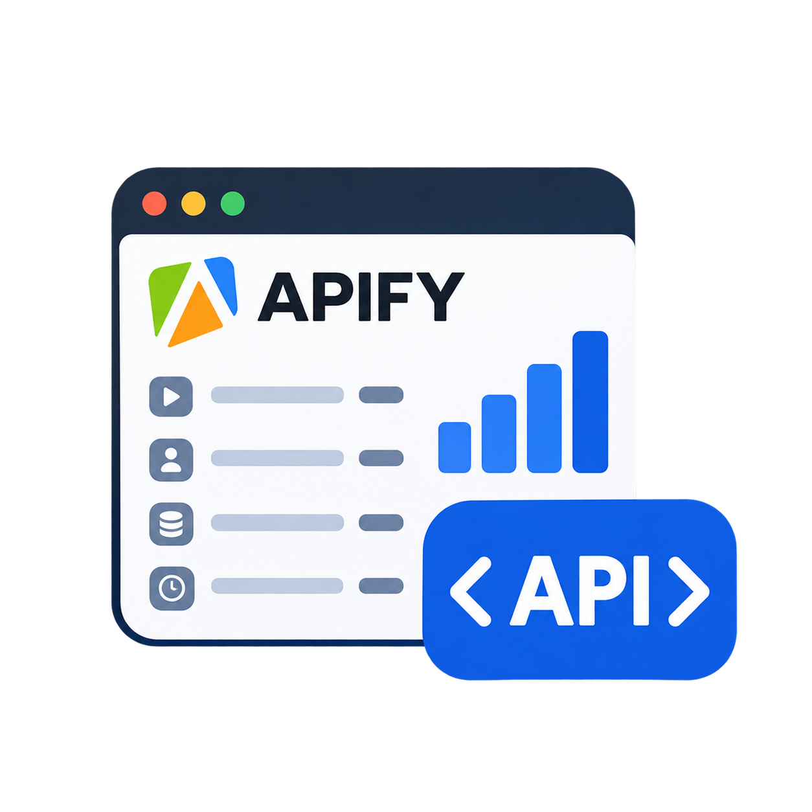
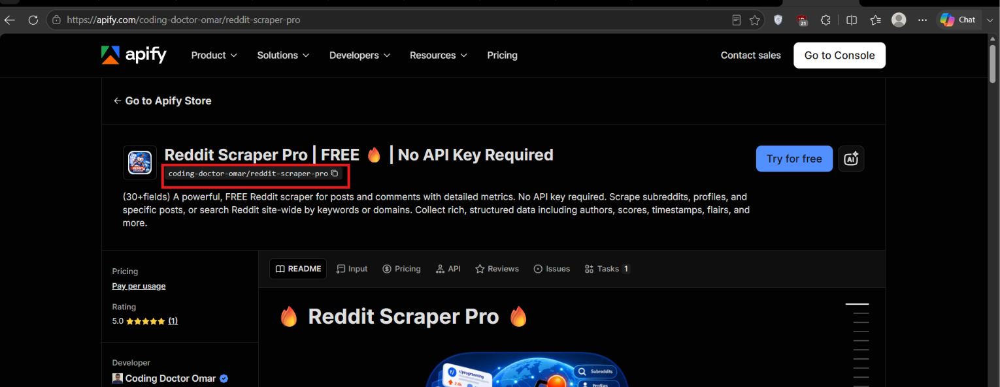

# Apify Actor Stats API

<p align="center">
    
</p>

<p align="center">
  <a href="https://ko-fi.com/CodingDoctorOmar">
    
  </a>
</p>

## Introduction

**Apify Actor Stats API** is an unofficial, lightweight API that returns public Apify Actor stats for any given Actor slug. The purpose of this API is to provide a seamless way to get your public Actor stats without having to make complex Algolia POST requests. This API should make it easy to use your public Actor stats to create your custom Actor README badges via services like shield.io.


## Documentation

**BASE URL: `https://apify-actor-stats.vercel.app`**

**ENDPOINTS:**

1. GET &mdash; `/api/v1/actor-stats`

    **URL Query Parameters:**

    `actor_slug` &ndash; [*string*][*required*] &mdash; The Actor slug (e.g. `coding-doctor-omar/reddit-scraper-pro`).

## Example Python Usage

**STEP 1: Install requests.**

```bash
pip install requests
```

**STEP 2: Make a GET request to `/api/v1/actor-stats`.**

```python
import requests

base_url = "https://apify-actor-stats.vercel.app"
endpoint = "/api/v1/actor-stats"

parameters = {
    "actor_slug": "coding-doctor-omar/reddit-scraper-pro"
}

response = requests.get(url=base_url + endpoint, params=parameters)
actor_stats = response.json()

print(actor_stats)
```

## Example API Response

```json
{
  "actorNonFailureRate": 97.2,
  "actorPermissionLevel": "LIMITED_PERMISSIONS",
  "actorSuccessRate": 95.5,
  "categories": [],
  "createdAt": "2026-08-30T06:31:25.902Z",
  "defaultRunOptions": {
    "build": "latest",
    "maxItems": null,
    "maxTotalChargeUsd": 0,
    "memoryMbytes": 4096,
    "timeoutSecs": 0
  },
  "deploymentKey": "ssh-rsa AAAAB3NzaC1yc2EAAAADAQABAAABAQDWiganze5Ym+cU4s8tnN37D0qoUExMe/2G7D7niN4GZGmxHHFpzjUb8XojA/wjYiOV1+qnk5194t2SlZZn0mmjdQlzi+neRDnWUDtBQTp37fl3MPSHVC3mRultKMSKWOH+giC089oK4D9IfedTroe0TN7vs61A1IDvc4Cj5kbT+GMNaNN+H331GTTmIu1Bfe5ONdsYPLBEh+YIRwEZCx7SPh41yCyJ8VAj0U6AvODMNdbtyd40F7BP9zsU2llZQutlFr8lZg6FD07AcorPClP28srEkwuyPHsXaHk0drYZbH94riSfc09XqzyMVWf8ISex1yeQQpP1zQ0QJZ7oo3vZ \n",
  "description": "(30+ fields) A powerful, FREE Reddit scraper for posts and comments with detailed metrics. No API key required. Scrape subreddits, profiles, and specific posts, or search Reddit site-wide by keywords or domains. Collect rich, structured data including authors, scores, timestamps, flairs, and more.",
  "exampleRunInput": {
    "body": "{ \"helloWorld\": 123 }",
    "contentType": "application/json; charset=utf-8"
  },
  "hasNoDataset": false,
  "id": "mw5JvRF7kSxjfNqdu",
  "isCritical": false,
  "isDeprecated": false,
  "isGeneric": false,
  "isPublic": true,
  "isSourceCodeHidden": true,
  "modifiedAt": "2026-09-27T09:25:56.908Z",
  "name": "Reddit-Scraper-Pro",
  "notice": "NONE",
  "pictureUrl": "https://apify-image-uploads-prod.s3.us-east-1.amazonaws.com/9ZFcPlTHP3OBsxE7I-actor-mw5JvRF7kSxjfNqdu-G2h1xdIb3w-reddit_scraper_pro.png",
  "readmeSummary": "## Reddit Scraper Pro\n\nA Reddit web scraper that extracts structured posts and comments data from subreddits, user profiles, and individual post URLs, and performs site-wide searches by keywords or referenced domains. Operates via web scraping (no Reddit API key required) and supports Standard, Keyword Search, and Domain Search modes, including advanced keyword expressions. Captures hierarchical comment threads with configurable depth and per-post limits and extracts rich metadata and engagement signals such as authors, timestamps, scores, upvote ratios, flairs, post types (text/image/video/gallery/link/poll), crosspost relationships, media URLs (images, galleries, videos, thumbnails), URLs, subreddit context, and other derived fields (30+ structured fields) for analysis, monitoring, and content collection workflows.\n\n## Use cases\n\n- Scrape posts and comments from specified subreddits.\n- Scrape posts and comments from Reddit user profiles.\n- Scrape specific individual post URLs.\n- Perform site-wide keyword search to find posts and comments containing or excluding specified terms, including advanced search expressions.\n- Perform site-wide domain search to find posts and comments that reference one or more domains.\n- Collect hierarchical comment threads with configurable depth and limits per post.\n- Extract media links and engagement metadata (images, galleries, videos, thumbnails, scores, upvote ratios, crosspost info, timestamps, flairs).",
  "seoDescription": "[30+ Fields Per Item] Scrape Reddit posts and comments from subreddits, profiles, and/or your list of post URLs. Additionally, scrape posts based on keywords or domains! FREE & No API Key Required.",
  "seoTitle": "Reddit Scraper Pro | FREE 🔥 | No API Key Required",
  "standbyUrl": null,
  "stats": {
    "actorReviewCount": 0,
    "actorReviewRating": 0,
    "bookmarkCount": 0,
    "lastRunStartedAt": "2026-09-30T00:57:18.585Z",
    "publicActorRunStats30Days": {
      "ABORTED": 10,
      "FAILED": 19,
      "SUCCEEDED": 659,
      "TIMED-OUT": 2,
      "TOTAL": 690
    },
    "totalBuilds": 39,
    "totalRuns": 746,
    "totalUsers": 71,
    "totalUsers30Days": 31,
    "totalUsers7Days": 8,
    "totalUsers90Days": 31
  },
  "taggedBuilds": {
    "latest": {
      "buildId": "gIz7NCFBrV4WRWbEX",
      "buildNumber": "0.0.39",
      "buildNumberInt": 39,
      "finishedAt": "2026-09-15T07:42:39.181Z"
    }
  },
  "title": "Reddit Scraper Pro | FREE 🔥 | No API Key Required",
  "userId": "9ZFcPlTHP3OBsxE7I",
  "username": "coding-doctor-omar",
  "versions": [
    {
      "buildTag": "latest",
      "sourceType": "GIT_REPO",
      "versionNumber": "0.0"
    }
  ]
}
```

## Where to Find the Actor Slug?




## Using this API to Generate Your Custom Actor README Badges

In the example below, this API is used to generate a custom Success Rate badge for my Apify Actor.

1. My Actor's slug is `coding-doctor-omar/reddit-scraper-pro`.
2. The GET request URL would be (url encoded): `https://apify-actor-stats.vercel.app/api/v1/actor-stats?actor_slug=coding-doctor-omar%2Freddit-scraper-pro`.
3. The shields.io badge url would be (url encoded): `https://img.shields.io/badge/dynamic/json?url=https%3A%2F%2Fapify-actor-stats.vercel.app%2Fapi%2Fv1%2Factor-stats%3Factor_slug%3Dcoding-doctor-omar%2Freddit-scraper-pro&query=%24.actorNonFailureRate&suffix=%25&label=Success%20Rate&labelColor=gray&color=green`

In this example, I am setting the label text to be `Success Rate`, the color of the right part to be `green`, and the suffix to be a `%` symbol.

The end result looks like this:


For more information, you can read the [shields.io documentation](https://shields.io/badges/dynamic-json-badge).